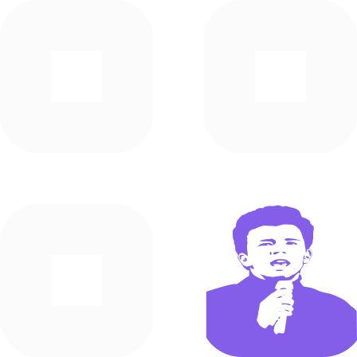

<!-- Center Shields -->

 

  

  <h3 align="center">This is Not A QR Code Generator</h3>

  

    A very simple web app intended as a school project, this project was used to learn CI/CD and Unit Testing
     
    <a href="https://github.com/Matthis-F/not-a-qr-generator"><strong>Explore the docs »</strong></a>
     
     
    <a href="https://github.com/Matthis-F/not-a-qr-generator/">View Demo</a>
    ·
    <a href="https://github.com/Matthis-F/not-a-qr-generator/issues">Report Bug</a>
    ·
    <a href="https://github.com/Matthis-F/not-a-qr-generator">Request Feature</a>
  

