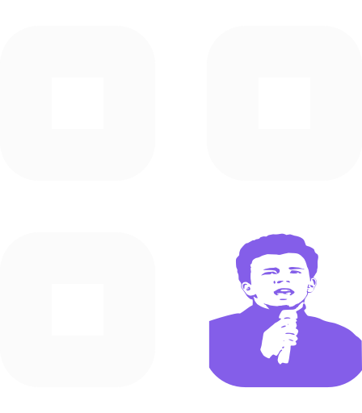
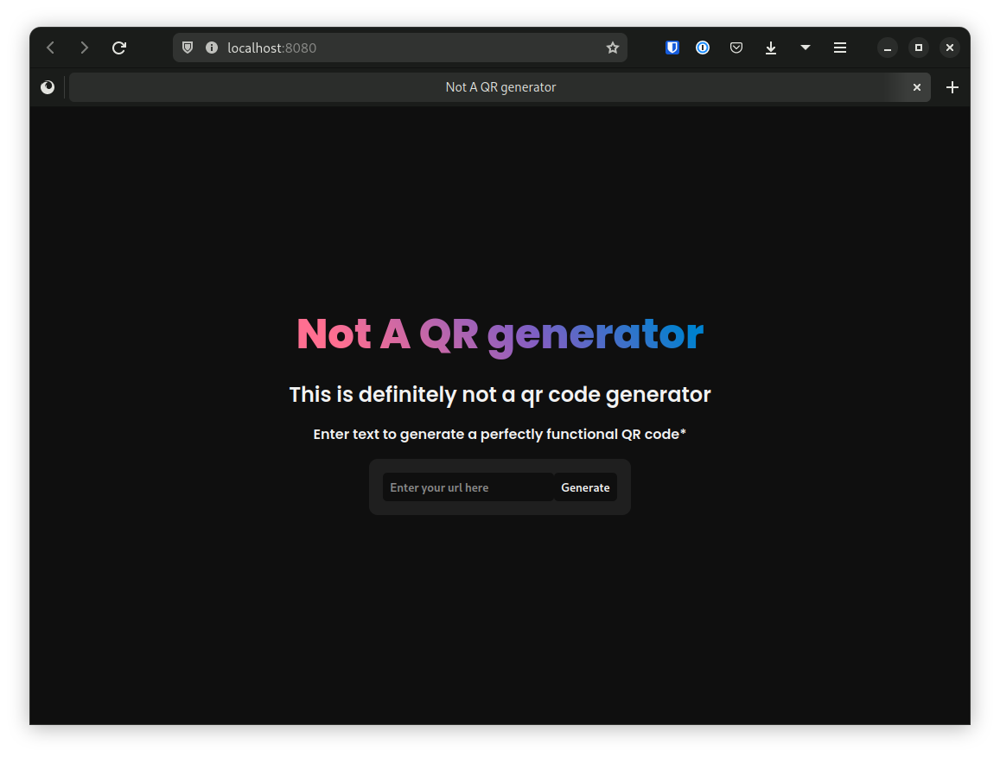

<a name="readme-top"></a>
<!-- Center Shields -->
<div align="center">

[](https://github.com/Matthis-F/not-a-qr-generator/graphs/contributors)
[](https://github.com/Matthis-F/not-a-qr-generator/network/members)
[](https://www.linkedin.com/in/foulonneau/)

</div>

<br />
<div align="center">
  <a href="https://qr.foulonneau.com/">
    
  </a>

  <h2 align="center" ><b>This is Not A QR Code Generator</b></h2>

  <p align="center">
    A very simple web app intended as a school project, this project was used to learn CI/CD and Unit Testing
    <br />
    <br />
    <a href="https://qr.foulonneau.com/"><b>Demo: qr.foulopnneau.com</b></a>
    ·
    <a href="https://github.com/Matthis-F/not-a-qr-generator/issues">Report Bug</a>
    ·
    <a href="https://github.com/Matthis-F/not-a-qr-generator/">Request Feature</a>
  </p>
</div>

## Table of Contents

- [Table of Contents](#table-of-contents)
- [About The Project](#about-the-project)
  - [Built With](#built-with)
- [Getting Started](#getting-started)
  - [API](#api)
    - [Build and run](#build-and-run)
    - [Development](#development)
    - [API Documentation](#api-documentation)
  - [Webapp](#webapp)
    - [Build and run](#build-and-run-1)
    - [Development](#development-1)
- [Contact](#contact)
- [License](#license)


## About The Project
Not A QR Genertaor is a simple web app that allows you to generate Rickroll QR codes from a text input.

It provides an API to get random Rickroll QR codes plus a web app to gracefully display them.
It also has the capability to generate real QR codes from the original text input.



### Built With
| API | Webapp |
| --- | --- |
| [Nodejs](https://nodejs.org/en/) | [Nodejs](https://nodejs.org/en/) |
| [Express](https://expressjs.com/) | [Express](https://expressjs.com/) |
| [qrcode](https://www.npmjs.com/package/qrcode)| [PUGjs](https://pugjs.org/api/getting-started.html) |

## Getting Started
### API
#### Build and run (Production)
```sh
cd server
npm install
npm start
```
#### Development
```sh
cd server
npm install
npm run dev
```
#### API Documentation
Only two endpoints are available, one to get a random Rickroll QR code and one to get a Real QR code from the text input.
| Method | Endpoint | Description |
| --- | --- | --- |
| GET | /api/qr | Get a random Rickroll QR code |
| GET | /api/qr/real?text | Get a Real QR code from the text input |

### Webapp
#### Build and run (Production)
```sh
cd webapp
npm install
npm start
```
#### Development
```sh
cd webapp
npm install
npm run dev
```
#### Unit Tests
```sh
cd webapp
npm run test
```

## Contact
Matthis Foulonneau - [LinkedIn](https://www.linkedin.com/in/foulonneau/) - [Email](mailto:matthis@foulonneau.com)

## License
GPL-3.0 License


